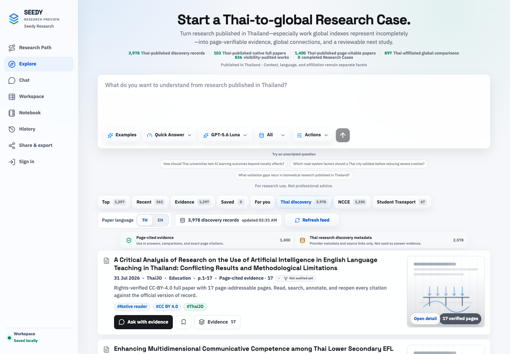

# Seedy Research

Thai-published research, connected to the world—and to the next study.

Seedy helps researchers find Thai evidence, read lawful full papers, compare it
with global research, and turn reviewed findings into a reusable research plan.
Universities and research institutes are the primary audience. Civil engineering
is the first proof vertical, not the product boundary.

[Try Seedy](https://seedresearch.vercel.app/) · [Evaluator guide](docs/WEBMCP_CHALLENGE_SUBMISSION.md) · [Connect an agent](https://seedresearch.vercel.app/developers) · [Run the checks](docs/HARNESS.md)



*Public guest view captured September 4, 2026 (Asia/Bangkok); no mocked responses.*

**Research Preview.** Implemented capabilities, dated verification, and expansion
plans are distinguished below. Research output is not professional advice or
proof of scientific novelty.

## One research case, from question to next study

1. **Discover:** start with a question and search research published in Thailand.
   Inspect a dated visibility receipt: exact global identity, metadata gaps,
   candidate match, no exact match in that audit, not audited, or unavailable.
2. **Read:** open the cited page or rights-cleared native full paper. Keep the
   original source, version, license, and page locator beside the finding.
3. **Review in Workspace:** screen selected papers, compare methods and findings
   in a literature-review matrix, and record PRISMA-guided decisions.
4. **Synthesize in Notebook:** send reviewed Workspace findings into the same
   Research Case. Use Sources–Chat–Studio for source-grounded conversation,
   persistent notes, and versioned research artifacts.
5. **Connect and plan:** inspect exact-DOI OpenAlex relationships, build a Research
   Path, and frame a candidate gap and falsifiable Next-Study Protocol.
6. **Review and export:** reopen the exact pages and accept or reject claims in
   a Research Passport. Export preserves evidence, metadata, and inference as
   separate layers.

Workspace and Notebook are distinct, connected features. Notebook Light Mode
uses bounded retrieval and model APIs over existing source records; the heavier
OpenRAG adapter is optional and inactive by default. This is not a claim that
the OpenRAG server is deployed.

## Why Seedy, alongside OpenAlex?

OpenAlex provides the global scholarly graph. Seedy works on the local evidence
and research workflow around it: Thai-provider discovery, dated visibility
comparisons, lawful page inspection, human review, and reusable research
artifacts. It does **not** submit or repair records in OpenAlex.

A failed lookup is not proof that a paper is globally invisible. Global
relationships remain metadata-only leads until the underlying evidence is
independently available and reviewed. A generated gap is a candidate to test,
not proven novelty.

## WebMCP: the agent and researcher share the page

Twelve browser-native tools reuse the application's APIs and update the same
visible Case, evidence drawer, connection map, Passport, Research Path,
Workspace, and Notebook.

| Tool | Purpose |
| --- | --- |
| `start_research_case` | Start or resume a question and bounded Thai discovery |
| `discover_research` | Find Thai-local sources and optional global comparison leads |
| `audit_global_visibility` | Inspect a dated comparison receipt |
| `inspect_paper_evidence` | Open bounded exact-page evidence and lawful reader state |
| `trace_research_connections` | Trace an exact-DOI identity into global metadata |
| `draft_research_passport` | Draft from inspected anchors, preserving the review gate |
| `build_research_path` | Create or adapt an evidence-grounded study path |
| `inspect_learning_progress` | Inspect checkpoints without exposing private answers |
| `open_research_notebook` | Open the visible Case Notebook and list public Case Sources |
| `send_reviewed_to_notebook` | Continue human-reviewed Workspace evidence as a versioned pack |
| `ask_research_notebook` | Create a cited answer from explicit public Case Sources |
| `draft_notebook_artifact` | Draft a cited, versioned Studio artifact for human review |

Tools validate inputs and honor cancellation. Source text is untrusted input.
Browser agents cannot turn metadata into evidence, read private Notebook
history, verify Workspace cells for a person, or bypass Passport review.
The separate remote MCP service supports clients without an open browser page.

## Data and verification

September 2, 2026 snapshot:

| Cohort | Recorded scope |
| --- | ---: |
| ThaiJO discovery catalog, including native papers | 2,681 records |
| Thai-published native full papers | 103 papers |
| Thai-affiliated global comparison full papers | 897 papers |
| Legacy civil page-citable corpus | 1,297 papers |

The native reader total is 1,000 papers / 14,485 pages; it is not 1,000
Thai-local papers. TNRR, TCI, TDC, conferences, and institutional repositories
have separate promotion and partnership gates. National completeness is not
claimed. [Dated corpus details and integrity limits](docs/CORPUS_STATUS.md) ·
[Source rights](DATA_SOURCES.md) · [Expansion plan](docs/DATA_EXPANSION.md)

The repository includes three rights-reviewed reader papers (68 pages) and
synthetic test fixtures. The production corpus is not distributed in Git.
Fixture tests verify application contracts, not live retrieval quality,
authenticated database isolation, host compatibility, or traffic capacity.
See [verification scopes and commands](docs/HARNESS.md) and
[rollout requirements](docs/LAUNCH_READINESS.md).

## Reproduce without production credentials

Requires Python 3.10, Node.js 20, and npm. From a fresh clone:

```bash
git clone https://github.com/LeChiffreVol2/Seedy_Research.git
cd Seedy_Research
python3.10 -m venv .venv310
. .venv310/bin/activate
python -m pip install 'beautifulsoup4>=4.12,<5' 'requests>=2.32,<3'
npm ci --prefix web
make fixture-check
cd web && npx playwright install chromium && cd ..
make fixture-browser
```

No Supabase project or paid API key is needed for this fixture gate. It runs
real application code with explicitly mocked external boundaries; it is not a
standalone offline research service. For live local services, database setup,
and provider keys, follow [Operations](docs/OPERATIONS.md).

## Repository map

- `web/` — Next.js interface, server routes, and browser-native SeedyMCP tools.
- `mcp-server/` — FastAPI retrieval and remote MCP contracts.
- `pipeline/` — bounded harvesting, rights-aware ingestion, and visibility audits.
- `supabase/` — schema and additive migration history.
- `harness/`, `eval/` — contract, retrieval, security, and release checks.

[Architecture](docs/ARCHITECTURE.md) · [Product thesis](docs/PRODUCT_THESIS.md) ·
[Compatibility and archived work](docs/LEGACY_COMPATIBILITY.md)

## License and responsible use

The source code is [MIT licensed](LICENSE). That license does not grant rights
to papers, extracted text, or third-party datasets. Private uploads remain
owner-scoped and are not added to the public corpus.
[Privacy](https://seedresearch.vercel.app/privacy) ·
[Report a source or support issue](https://seedresearch.vercel.app/support)
